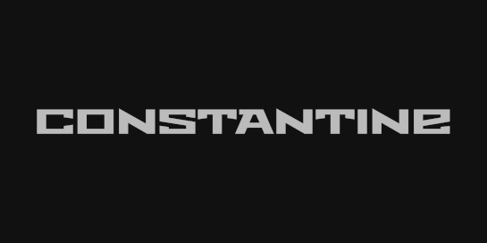

[](https://sonarcloud.io/dashboard?id=tomlutzenberger_constantine)


Constantine
=====================
The (hopefully) most comprehensive collection of constants for PHP

Requirements
------------

* PHP >=7.1
* nothing else, zero dependency

Installation
------------

The preferred way to install this extension is through [composer](http://getcomposer.org/download/).

Either run

```
php composer.phar require --prefer-dist tomlutzenberger/constantine "*"
```

or add

```
"tomlutzenberger/constantine": "*"
```

to the required section of your `composer.json` file.


Usage
-----
